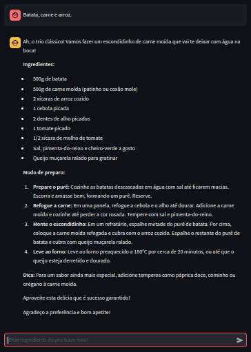
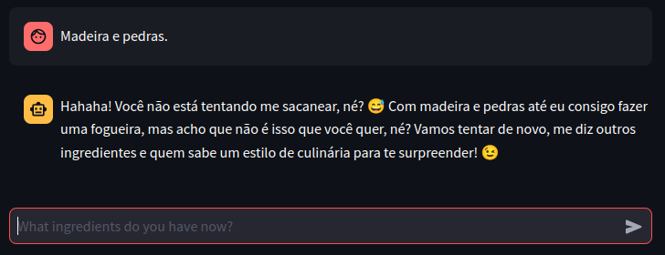

<div align="center">

  

</div>

# Magic Pantry @ Gemini AI chatbot Project 🤖

> Não sabe ler inglês? leia o README.md em _pt-br_ clicando [**aqui**](./docs/README-PTBR.md)!

> Magic Pantry: Discover what to cook with what you have. Unlock the magic of your pantry with this tool! Let us reveal the possibilities hidden in your ingredients, turning them into delicious meals.

- **Magic Pantry** is a funny and useful culinary chatbot that uses AI techniques ([**_zero-shot_** + **_chain of thought_**](https://www.promptingguide.ai/techniques/cot.en#zero-shot-cot-prompting)) to help users find recipes based on the ingredients they have at your pantry. Identifies ingredients, searches for compatible recipes, considers restrictions and preferences and presents suggestions in an organized way. The objective is to show to user how it is possible to make a tasty meal even with few resources.

## Authors 👥

- My name is Cauê and I'm graduating in Systems Development Technician at ETEC. I love technology and always seek to learn new knowledge. I am currently interning as a fullstack developer and learning about AI in Alura's immersion was very useful, as it is a growing field.
  - [**@dantsec**](https://www.github.com/dantsec)

## Tech Stack 🧑‍💻

- This project was developed with the following technologies:
  - [**Python**](https://www.python.org/) (Main Language)
    - [**Streamlit**](https://streamlit.io/) (Web Server)

## Documents 📂

- [**MIT License**](./LICENSE)
- [**Usability Example**](./docs/usability-example.pdf)

## Installation / Run Locally ⚙️

- **Important**: First of all, you must have [**Python 3 installed**](https://www.python.org/).

- Clone and enter in the project:
```bash
git clone https://github.com/dantsec/MagicPantry.git && cd MagicPantry/
```

- Run `setup.py`
```bash
python3 setup.py
```

- Start the server
```bash
python3 -m streamlit run src/app.py
```

## Live Demo 🔎

- You can access a live demo clicking [**here**](https://magic-pantry.streamlit.app/)!

## Screenshot 📷

> ChatBot homepage.


> Basic use.



> Leaving the context of AI utility.



## Todo List 📌

- Priority (**1**)
  - [ ] New pallete color.
    - https://colorhunt.co/palettes/food-yellow-red-orange
  - [ ] Button to clear chat.
- Priority (**2**)
  - [ ] When the user sends a photo of a food, the model will provide the possible recipe.
    - https://discuss.streamlit.io/t/adding-in-streamlit-chat-input-the-possibility-to-add-an-image/55156/3
- Priority (**3**)
  - [ ] Implement `venv`.

## Contributing 🛠️

```bash
# Create a fork from MagicPantry repository and clone it.
git clone https://github.com/YOUR_USERNAME/MagicPantry.git
# Enter into the folder.
cd MagicPantry/
# Create a new branch with the name feat-[WHAT_YOUR_FEAT_DO].
git checkout -b feat-[WHAT_YOUR_FEAT_DO]
# Make your changes and commit them.
git add . && git commit -m "YOUR_COMMIT_MESSAGE"
# Push and open a pull request.
git push origin main
```
