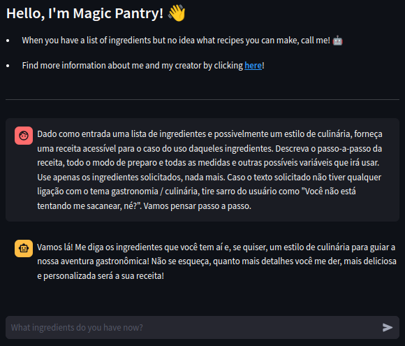
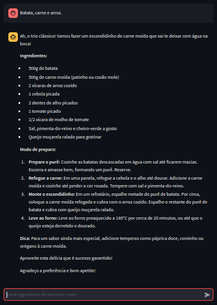

<div align="center">

  

</div>

# Magic Pantry @ Projeto de chatbot com Gemini AI 🤖

> Magic Pantry / Despensa Mágica: Descubra o que cozinhar com o que você tem. Desbloqueie a magia da sua despensa com esta ferramenta! Deixe-me revelar as possibilidades escondidas nos seus ingredientes, transformando-os em deliciosas refeições.

- **Magic Pantry** ou **Despensa Mágica** é um chatbot culinário divertido e útil que usa técnicas de IA ([**_zero-shot_** + **_chain of thought_**](https://www.promptingguide.ai/techniques/cot.en#zero-shot-cot-prompting)) para ajudar os usuários a encontrar receitas com base nos ingredientes que têm em sua despensa. Identifica ingredientes, busca receitas compatíveis, considera restrições e preferências e apresenta sugestões de forma organizada. O objetivo é mostrar ao usuário como é possível fazer uma refeição saborosa mesmo com poucos recursos.

## Autores 👥

- Meu nome é Cauê e estou me formando em Técnico em Desenvolvimento de Sistemas pela ETEC. Adoro tecnologia e procuro sempre aprender novos conhecimentos. Atualmente estou estagiando como desenvolvedor fullstack e aprender sobre IA na imersão do Alura foi muito útil, pois é um campo em crescimento.
    - [**@dantsec**](https://www.github.com/dantsec)

## Stack de tecnologia 🧑‍💻

- Este projeto foi desenvolvido com as seguintes tecnologias:
    - [**Python**](https://www.python.org/)
      - [**Streamlit**](https://streamlit.io/) (servidor web)

## Documentos 📂

- [**Licença do MIT**](../LICENSE)
- [**Exemplo de Uso**](./usability-example.pdf)

## Instalação / execução local ⚙️

- **Importante**: Primeiro de tudo, você deve ter o [**Python 3 instalado**](https://www.python.org/).

- Clone e entre no projeto:
```bash
clone git https://github.com/dantsec/MagicPantry.git && cd MagicPantry/
```

- Execute `setup.py`
```bash
python3 setup.py
```

- Inicie o servidor
```bash
python3 -m streamlit run src/app.py
```

## Demonstração ao vivo 🔎

- Você pode acessar uma demonstração ao vivo clicando [**aqui**](https://magic-pantry.streamlit.app/)!

## Captura de tela 📷

> Página inicial do ChatBot.



> Uso básico.



> Sair do contexto de utilidade da IA.


## Contribuindo 🛠️

```bash
# Crie um fork do repositório MagicPantry e clone-o.
clone do git https://github.com/SEU_NOME_DE_USUÁRIO/MagicPantry.git
# Entre na pasta.
cd MagicPantry/
# Crie um novo branch com o nome feat-[UTILIDADE_DA_FEAT].
git checkout -b feat-[UTILIDADE_DA_FEAT]
# Faça suas alterações e confirme-as.
adicione. && git commit -m "SUA_MENSAGEM_DE_COMMIT"
# Envie e abra uma pull request.
git push origin main
```
